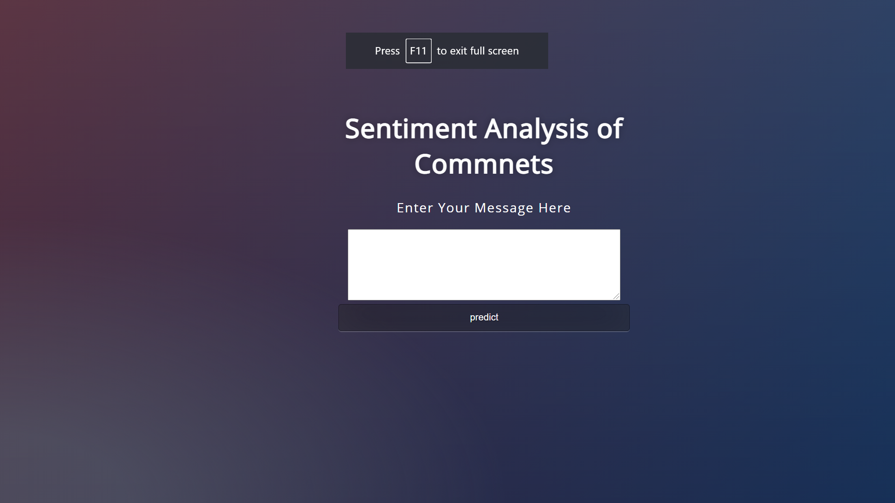
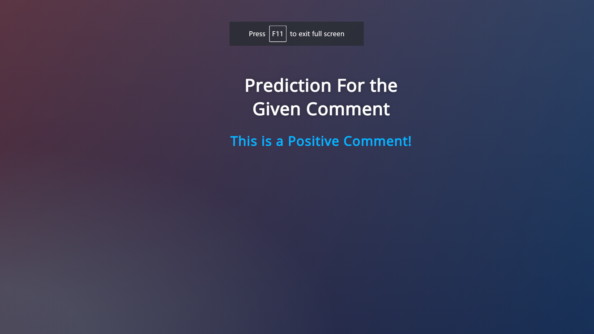
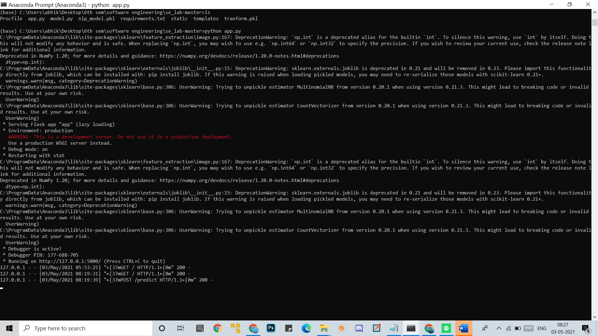
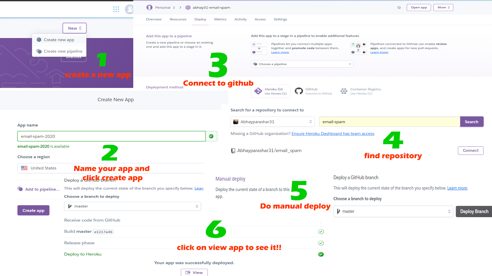

# Project: Sentiment Analyser

Abhishek Kumar - 185540
Ritwik Duggal - 185528
Himansh - 185539

---



According to an article on Forbes, we produce around 2.5 quintillion bytes of data every day, and these numbers are going to increase up to 5 times in the next five years. Out of that huge amount of data, almost 90% of data is unlabelled and unuseful. It is unuseful because we don’t know how to use it. Here comes the role of data scientist and machine learning experts. A data scientist has all the abilities to convert that unusable data into some useful form so that anyone can understand it.

One of the huge parts from that data is text data whether it is in the form reviews, messages, complaints, and more. At the present time, one of the main tasks is to design some kind of technique using which we can classify the data easily and better understand it. Here comes the role of **Natural Language Processing**. Natural language processing allows us to understand the text data very well. It gives us the power to classify the text between different categories. If you are in the profession of Computer Science then you must have to learn these things and their concepts very well.

---

### We are going to complete our project in four steps:

1. Create a model using ML and NLP
2. Creating a web app using flask and connecting it with model
3. Commit project to Github
4. Deploy our model using Heroku

*** 

## Environment Setup

### 1. Download the Latest Version of Python


### 2. Install Required Packages

One can install all the packages using pip from cmd(terminal)

```
pip install pandas,numpy,scikit-learn,matplotlib,nltk,seaborn
```

### 3. Install Jupyter Notebook

```
pip install jupyter-notebook
jupyter notebook ## For running
```

After completing the above three step we can work on our project.

---

## 1. Creating the model ML and NLP

**Importing libraries**


```python
import pandas as pd                #for datafram Manipulation
import numpy as np                 #for array manipulation
import matplotlib.pyplot as plt    #for plotting graph
import bz2                         #for compressing and decompressing
from sklearn.metrics import f1_score, roc_auc_score, accuracy_score    #for model
import re                          #for regular expression

%matplotlib inline
```

**Creating a function to load the text and labels from train and test set**


```python
def get_labels_and_texts(file):
    labels = []                         #labels array
    texts = []                          #texts aray
    for line in bz2.BZ2File(file):      #loop to read all the compressed file
        x = line.decode("utf-8")
        labels.append(int(x[9]) - 1)
        texts.append(x[10:].strip()) 
    return np.array(labels), texts      #returning the array of labels and texts from compressed file 
```

**The Dataset**

The dataset which we are going to use is an open-source dataset available on Kaggle.

1. ***About the dataset***

The dataset contains three columns. The size of the dataset is around 120 mb. It has around 10000 rows in total.

2. ***Columns***

Label: **0** and **1**
Text: a collection of Text
Label_num: 0 for Negative and 1 for positive

3. ***Task*** 

Our Task is to create a machine learning  model that can accurately predict whether a comment is showig positive or negative sentiment.


**Loading our dataset into the notebook**


```python
train_labels, train_texts = get_labels_and_texts('train.ft.txt.bz2') #Train data 
test_labels,  test_texts  = get_labels_and_texts('test.ft.txt.bz2')  #Test data
```

*Sample of Labels DATA*


```python
train_labels[0]
```

*Sample of Texts DATA*


```python
train_texts[0]
```

*Labels for first 500 DATA*


```python
train_labels=train_labels[0:500]
print(train_labels)
```

    [1 1 1 1 1 1 0 1 1 1 0 1 1 0 0 0 1 1 1 0 0 1 0 1 1 0 0 0 0 1 0 1 0 1 0 0 1
     1 0 0 0 0 1 1 1 1 0 1 0 0 1 1 0 1 0 1 1 0 1 0 1 0 0 1 0 0 1 1 1 1 0 0 1 1
     0 0 0 1 0 1 0 1 1 1 1 1 0 1 0 0 0 1 1 0 1 0 1 0 1 0 1 1 1 0 0 0 1 0 0 1 1
     1 0 1 1 1 1 0 0 1 1 0 1 1 1 1 1 1 0 1 0 1 0 1 0 1 0 1 1 1 1 1 0 1 0 0 0 0
     0 0 0 0 0 1 0 1 0 1 1 1 0 1 1 1 0 1 0 1 1 1 1 1 1 1 0 1 0 1 1 0 0 0 0 0 0
     1 1 1 1 0 0 1 1 1 1 1 0 0 0 0 0 0 0 0 1 1 0 0 0 1 1 1 0 0 0 0 0 0 1 1 1 0
     1 0 1 0 0 0 1 1 1 1 1 1 1 1 1 1 1 1 1 1 1 1 0 1 0 0 1 1 1 1 0 0 0 0 0 0 0
     0 1 0 1 0 1 0 0 0 0 1 0 0 0 1 0 1 1 1 1 1 1 1 1 1 0 0 0 0 0 0 0 1 0 0 1 1
     1 0 0 1 0 0 0 1 1 0 1 1 1 1 1 0 1 1 1 1 0 1 1 1 1 0 1 0 1 0 1 1 1 0 1 0 1
     1 1 1 1 1 0 0 1 0 1 1 1 1 1 1 1 0 0 1 1 0 0 0 0 1 1 1 1 0 0 0 1 1 0 1 1 1
     1 0 1 1 0 0 0 1 0 0 1 1 1 1 1 0 1 1 0 0 0 0 0 0 0 0 1 0 0 1 0 0 0 0 0 0 0
     0 0 0 0 0 0 0 1 0 0 0 0 0 0 0 1 1 0 0 0 1 1 1 1 1 1 0 0 1 0 0 0 0 1 0 0 1
     0 1 1 0 1 0 0 1 0 0 0 0 0 0 0 1 0 0 0 1 0 0 0 0 0 1 1 1 0 0 0 0 0 0 1 0 1
     1 1 0 0 0 1 1 0 0 0 0 0 0 1 1 1 1 1 1]
    

*Text of first 500 DATA*


```python
train_texts=train_texts[0:500]

```

# Text Pre-processing


```python
import re
NON_ALPHANUM = re.compile(r'[\W]')           #Alphanumeric Character
NON_ASCII = re.compile(r'[^a-z0-1\s]')       #NON ASCII Character
def normalize_texts(texts):
    normalized_texts = []
    for text in texts:                       #Reading Each Line
        lower = text.lower()                 #Lowercasing
        no_punctuation = NON_ALPHANUM.sub(r' ', lower)
        no_non_ascii = NON_ASCII.sub(r'', no_punctuation)
        normalized_texts.append(no_non_ascii)
    return normalized_texts                  #returning normalized text
        
```

**Explanation:**

1. we are importing re library, which is used to perform regex in python.
2. Define an empty corpus list, that can be used to store all the text after cleaning.
3. initializing the var length with the length of the data frame.
4. running a loop from 0 to the length of our data frame.
5. Removing all characters except the lower alphabet, bigger alphabets, and digits.
6. Converting the text to lower.
7. Splitting the text by spaces.
8. creating an object of porter stemmer.
9. Initializing all the stopword in English dictionary to var stopword
10. Running a loop in the length of the sentence and then for each word in the sentence checking it in stopword and if it does not find in stopword then apply Stemming on to the text and add it to the list.
11. Just concatenating all the words to make a sentence
12. appending the sentence to the corpus list
13. Printing the corpus list.

*Normalization of TEXT*


```python
train_texts = normalize_texts(train_texts)
test_texts  = normalize_texts(test_texts)
```

In Cleaning Process the next step is to convert the list of the sentence(corpus) into vectors so that we can feed this data into our machine learning model. for converting the text into vectors we are going to use a bag of words which is going to convert the text into binary form.

**Count Vectorizer**

Converting Text into Vector Format


```python
from sklearn.feature_extraction.text import CountVectorizer

cv = CountVectorizer(binary=True)
X = cv.fit_transform(train_texts)
X_test = cv.fit_transform(test_texts)
```

1. We are importing the CountVectorizer from sklearn.
2. Creating an object for the count vectorizer with max features as 35000, means we are only fetching the top 35000 columns.
3. Using CV we are fitting are corpus and also transforming it into vectors.

**Dumping the CV for future use**

For doing predictions of new emails we need to save both our model and count vectorizer.


```python
import pickle                                 ## importing pickle used for dumping models
pickle.dump(cv, open('transform.pkl', 'wb'))  ## saving to into cv.pkl file
```

**Modeling and Training**

1. Splitting data into train and validation sets using train_test_split

2. Training the Model Linear Regression using different value of c

3. Checking the accuracy of each model.


```python
from sklearn.linear_model import LogisticRegression
from sklearn.metrics import accuracy_score
from sklearn.model_selection import train_test_split


X_train, X_val, y_train, y_val = train_test_split(
    X, train_labels, train_size = 0.75
)                                                         #Splitting the Data set in 75:25 ration

for c in [0.01, 0.05, 0.25, 0.5, 1]:                      #Loop to find best fit for the C Value
        lr = LogisticRegression(C=c)                      #Model fitting
        lr.fit(X_train, y_train)
        print ("Accuracy for C=%s: %s" 
        % (c, accuracy_score(y_val, lr.predict(X_val))))


```

    Accuracy for C= (0.05, 0.792)
    

## Great, we got an accuracy of 79% for c=0.05

**Saving Our Model in .pkl format**

To save our model we are going to use pickle.


```python
import pickle
pickle.dump(lr, open("nlp_model.pkl", "wb"))
```

## 2. Creating a web app using flask and connecting it with model

So to create a web app let’s first prepare a folder structure like below

> ***Comment(root)***

>    **|____templates**

>           |___index.html  ## homepage file

>           |___result.html ## to show prediction

>   **|____static**

>           |____style.css  ## css file 

>   **|____app.py**  ## main flask file

>   **|_____nlp_model.pkl** ## ml model

>   **|______transform.pkl**  ## count vectorizer


***Index.html***

create an input field for users to enter new Comments, and a button to send the text onto the server.


***Result.html***

it’s your wish whether you would like to show a gif or just plain text or both in place of Positive or Negative Comment.



***style.css***

it is a css file that is used to make the web page looks good. it’s up to you just design as you wish.

***app.py:***


```python
from flask import Flask,render_template,url_for,request
import pandas as pd 
import pickle
from sklearn.feature_extraction.text import CountVectorizer
from sklearn.naive_bayes import MultinomialNB
from sklearn.externals import joblib
import pickle

# load the model from disk
filename = 'nlp_model.pkl'
clf = pickle.load(open(filename, 'rb'))
# Load trasnform for vectorising the message
cv=pickle.load(open('tranform.pkl','rb'))
#App Name
app = Flask(__name__)
#Routing the App
@app.route('/')
#Defining the Home Function to call Home.html
def home():
	return render_template('home.html')
#Routing the return Message using Post Method
@app.route('/predict',methods=['POST'])
#Function for Predicting the Post Request
def predict():
	if request.method == 'POST':
		message = request.form['message']
		data = [message]
		vect = cv.transform(data).toarray()
		my_prediction = clf.predict(vect)
	return render_template('result.html',prediction = my_prediction)

if __name__ == '__main__':
	app.run(debug=True)
```

Now let’s run our code onto our localhost.

Open CMD and go to the root(comment) folder and then run app.py using python app.py then you will see some message like this👇



Just open the URL(http://127.0.0.1:5000/) in any browser and test the web app using some new random comments.

---

## 3. Commit The Project to Github

Before committing the project to Github we also going to create two more files.

1. **Profile**

Heroku apps include a *Procfile* that specifies the commands that are executed by the app on startup.

> web: gunicorn app:app

2. **Requirments.txt**

*requirements.txt* file is used for specifying what python packages are required to run the project.

```
Flask==1.1.1
gunicorn==19.9.0
itsdangerous==1.1.0
Jinja2==2.10.1
MarkupSafe==1.1.1
Werkzeug==0.15.5
numpy>=1.9.2
scipy>=0.15.1
scikit-learn>=0.18
matplotlib>=1.4.3
pandas>=0.19
```

Now after that, go to your Github account and upload the files and then commit to the branch.

Follow the below steps if you don’t know how to do it.


Final File Structure should be like this:


## 4. Deploy model using Heroku

Visit Heroku and create a free account and then log in to your account.

After login create a new app and connect it with you Github after that do manual deploy. you will see a URL you that URL to access your app.

if you don’t know how to do it just follow the steps shown in the picture.



